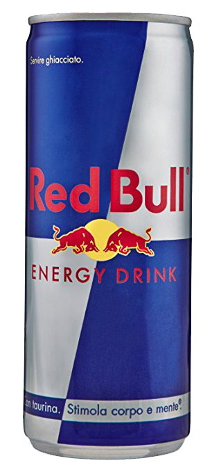
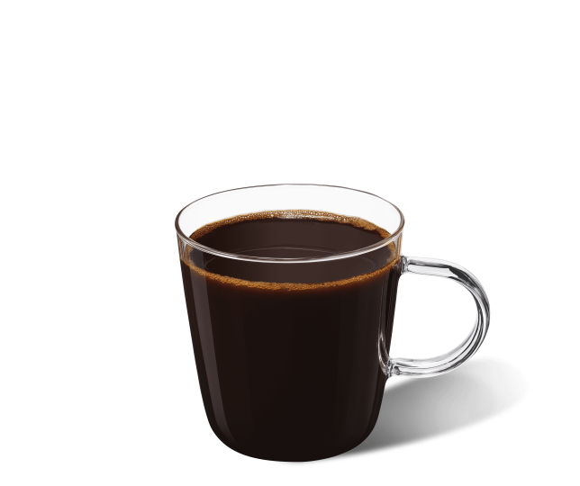
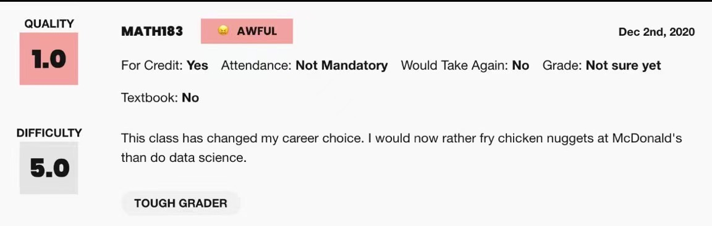
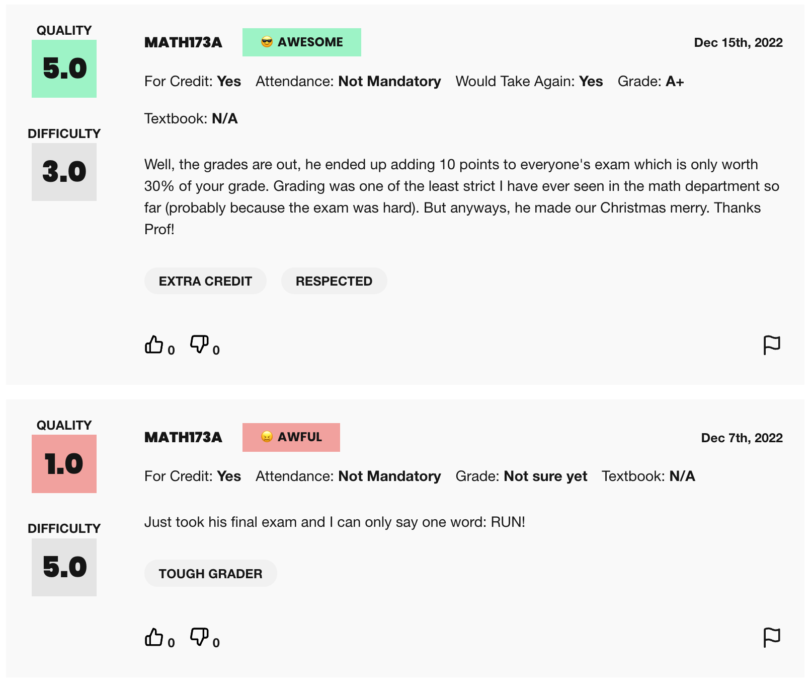
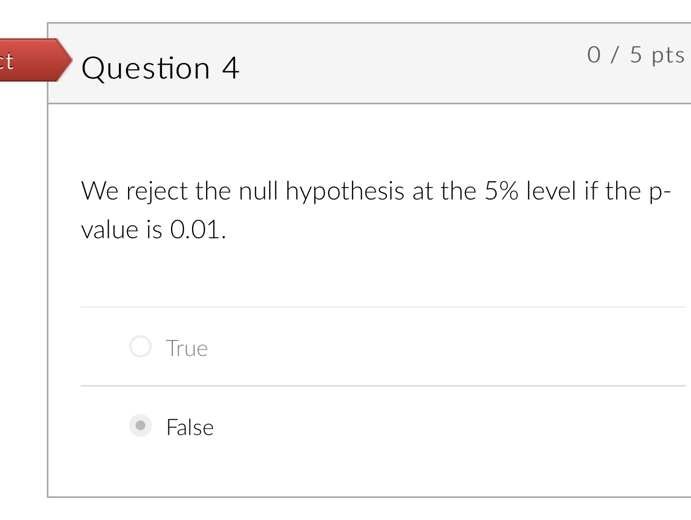

Outside of academics, my hobbies include working out, playing football🏈 and basketball🏀, hiking🏃, playing PUBG mobile, watching YouTube videos, and more. As I went to high school near Chicago, I am a big Chicago Bears fan! 🐻⬇️

This page serve as a place to keep all random things about me.

<!-- ## Table of contents
{: .no_toc .text-delta }

1. TOC
{:toc} -->

### Cat learning 🐱
Meet Emo! Who needs machine learning when my cat is learning? 😭

<iframe width="560" height="315" src="https://drive.google.com/file/d/1Vguu5bmrp7AQxxrX-nQrOO8CwFWdg4xD/preview" title="CatLearning" frameborder="0" allow="accelerometer; autoplay; clipboard-write; encrypted-media; gyroscope; picture-in-picture; web-share" allowfullscreen></iframe>

Here are some of her memes, feel free to follow [her Instagram](https://www.instagram.com/emo_caviar/) for more!

<!-- 

    

        
    

    

        
    

    

        
    

    

        
    

 -->

    

        
    

    

        
    

    

        
    

    

        
    

### Drinks for all-nighters 💪

Essential knowledge for college students nowadays...

<table>
  <thead>
    <tr>
      <th>Product</th>
      <th>Image</th>
      <th>Rating</th>
      <th>Comments</th>
    </tr>
  </thead>
  <tbody>
    <tr>
      <td><strong>Lanfy Silky Milk Tea</strong></td>
      <td style="padding:2.5%;width:25%;vertical-align:middle;min-width:120px">
        
      </td>
      <td>10</td>
      <td>This product works like magic but be careful. You may stay up for one or two days after finishing it. Use with caution! ⚠️</td>
    </tr>
    <tr>
      <td><strong>Red Bull</strong></td>
      <td style="padding:2.5%;width:25%;vertical-align:middle;min-width:120px">
        
      </td>
      <td>8</td>
      <td>"Red Bull gives you wings." This is my second best choice, and it's easy to purchase.</td>
    </tr>
    <tr>
      <td><strong>Coffee</strong></td>
      <td style="padding:2.5%;width:25%;vertical-align:middle;min-width:120px">
        
      </td>
      <td>0</td>
      <td>Believe it or not, whenever I try to stay up and drink some coffee, it always makes me fall asleep! 😣</td>
    </tr>
  </tbody>
</table>

### RMP highlights

Recording the most interesting rate my professor reviews I have seen so far:

- Might be a good choice 🤔️

  

- "A curve on the exam will make you the best Professor in the world".

  

### A silly mistake 🤯

I ended up breaking my cumulative 4.0 in my sophomore year just because of this problem 😅

### A dangerous social experiment

What will happen if you call your 65-year-old track coach by his first name? (This was for a social experiment in my AP Psychology class).

<iframe width="560" height="315" src="https://drive.google.com/file/d/1y0nbZ5wQLjRz6WnlyL5IPsz8oCScHKO_/preview" title="SocialExperiment" frameborder="0" allow="accelerometer; autoplay; clipboard-write; encrypted-media; gyroscope; picture-in-picture; web-share" allowfullscreen></iframe>

### Guitar during 2020 quarantine

My friends taught me to play guitar during the pandemic. Here's a video of us in case I lose it.

<iframe width="560" height="315" src="https://drive.google.com/file/d/1e6YvbNCuiwKoiHH-r-j5vdalmtLzu0wP/preview" title="MePlayingGuitar" frameborder="0" allow="accelerometer; autoplay; clipboard-write; encrypted-media; gyroscope; picture-in-picture; web-share" allowfullscreen></iframe>

