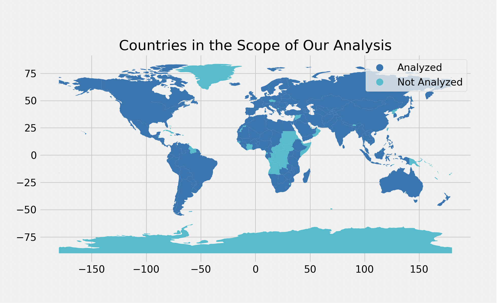
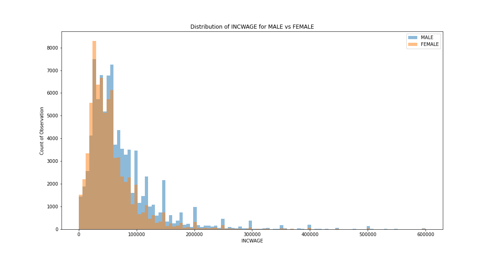

This page is still under construction. More content will be added soon!

### AI/ML

<table style="width:100%;border:0px;border-spacing:0px;border-collapse:separate;margin-right:auto;margin-left:auto;">
  <tr>
    <td style="padding:2.5%;width:25%;vertical-align:middle;min-width:120px">
      
    </td>
    <td style="padding:2.5%;width:75%;vertical-align:middle">
      <h3>Generative Vision: Image Synthesis with Conditional DCGANs</h3>
      <strong>Weiyue Li</strong>, Charles Ye
       
      <a href="https://github.com/weiyueli7/cGANs-cDCGANs/blob/main/doc/report.pdf">report</a> / <a href="https://github.com/weiyueli7/cGANs-cDCGANs">code</a>
      
Our project proposes two architectures with early or late concatenations to improve the performance of the original cGANs paper's architecture. The project involves training cDCGANs and cGANs on large-scale labeled datasets, where the models are conditioned on auxiliary information such as class labels. We also employ various metrics to evaluate the performance, and the results show that our cDCGANs model validates its effectiveness in generating high-quality and realistic images.

    </td>
  </tr>
  <!-- <tr>
    <td style="padding:2.5%;width:25%;vertical-align:middle;min-width:120px">
      
    </td>
    <td style="padding:2.5%;width:75%;vertical-align:middle">
      <h3>DCGANs on Image Classification Task</h3>
      <strong>Weiyue Li</strong>, Yi Li
       
      <a href="https://github.com/weiyueli7/DCGANs/blob/main/report.pdf">report</a> / <a href="https://github.com/weiyueli7/DCGANs">code</a>
      
Our project aims to revolutionize image synthesis and classification by combining Deep Convolutional Generative Adversarial Networks (DCGANs) with Convolutional Neural Networks (CNNs). We seek to demonstrate the potential of DCGAN techniques in producing highly realistic images and achieving strong performance in image classification by utilizing these synthetic images during training.

    </td>
  </tr> -->
  <tr>
    <td style="padding:2.5%;width:25%;vertical-align:middle;min-width:120px">
      
    </td>
    <td style="padding:2.5%;width:75%;vertical-align:middle">
      <h3>Automatic Image Annotation</h3>
      Yi Li, <strong>Weiyue Li</strong>, Linghang Kong, Yibo Wei, Shuangmu Wu
       
      <a href="https://github.com/weiyueli7/Automatic-Image-Annotation/blob/main/report.pdf">report</a> / <a href="https://github.com/weiyueli7/Automatic-Image-Annotation">code</a>
      
In this project, we trained an algorithm to caption input images. This required the algorithm to identify objects in the images and match them to a corpus of text. We used PyTorch to implement multiple Recurrent Neural Network (RNN) models, including LSTM, Vanilla RNN, and a custom model (Architecture 2), to generate captions for the images in our dataset, specifically the well-known COCO Image Captioning Task.

    </td>
  </tr>
  <tr>
    <td style="padding:2.5%;width:25%;vertical-align:middle;min-width:120px">
      
    </td>
    <td style="padding:2.5%;width:75%;vertical-align:middle">
      <h3>Recipe Recommender System</h3>
      <strong>Weiyue Li</strong>, Yi Li, Xiaoyue Wang, Ruoyu Hou
       
      <a href="https://github.com/weiyueli7/Recipe-Recommender/blob/main/report.pdf">report</a> / <a href="https://github.com/weiyueli7/Recipe-Recommender">code</a>
      
In this project, we first performed exploratory data analysis on datasets from food.com. We then implemented various types of recommendation system models to recommend recipes to users, predict ratings based on sentiment analysis, and predict recipe categories.

    </td>
  </tr>
</table>

### Data Analysis

<table style="width:100%;border:0px;border-spacing:0px;border-collapse:separate;margin-right:auto;margin-left:auto;">
  <tr>
    <td style="padding:2.5%;width:25%;vertical-align:middle;min-width:120px">
      
    </td>
    <td style="padding:2.5%;width:75%;vertical-align:middle">
      <h3>Taming COVID-19 Statistics to Reflect Happiness Score Metrics</h3>
      Zirui Wang, <strong>Weiyue Li</strong>, Luning Yang, Yuru Zhou
       
      <a href="https://zwcolin.github.io/COVID-19-Happiness-Score/FinalProjectGroup065-Fa21.html">report</a> / <a href="https://github.com/zwcolin/COVID-19-Happiness-Score">code</a>
      
In this project, we make use of the vaccination/death data by country, and explore the relationship between the set of {nation-wide onset date of vaccination, average new vaccination/death rate across different time spans}, and various metrics of happiness score in 2021. In particular, we are trying to figure out to what extent our independent varibles, namely all COVID-19 related data, are correlated to these metrics (i.e. social support, healthy life expectancy, perception of corruption, and generosity) of happiness scores.

    </td>
  </tr>
</table>

### Econometrics

<table style="width:100%;border:0px;border-spacing:0px;border-collapse:separate;margin-right:auto;margin-left:auto;">
  <tr>
    <td style="padding:2.5%;width:25%;vertical-align:middle;min-width:120px">
      
    </td>
    <td style="padding:2.5%;width:75%;vertical-align:middle">
      <h3>Occupation in Wage Gap Between Sex</h3>
      Jiahui Cai, <strong>Weiyue Li</strong>
       
      <a href="https://github.com/weiyueli7/Wage-Gap-Analysis/blob/main/report.pdf">report</a> / <a href="https://github.com/weiyueli7/Wage-Gap-Analysis">code</a>
      
In this project, we perform a regression analysis to the IPUMS CPS data. In particular, we divide occupations into male-dominated, female-dominated, and equal-dominated and perform a regression analysis to aim for drawing a causal inference of occupation on the wage gap between sex during the COVID and post-COVID era.

    </td>
  </tr>
</table>

### Data Visualization

<table style="width:100%;border:0px;border-spacing:0px;border-collapse:separate;margin-right:auto;margin-left:auto;">
  <tr>
    <td style="padding:2.5%;width:25%;vertical-align:middle;min-width:120px">
      
    </td>
    <td style="padding:2.5%;width:75%;vertical-align:middle">
      <h3>NFL Players Visualization</h3>
      <strong>Weiyue Li</strong>
       
      <a href="https://weiyueli7.github.io/NFL-Players-Viz/">report</a> / <a href="https://github.com/weiyueli7/NFL-Players-Viz">code</a>
      
In this project, I have developed an interactive dashboard aimed at providing high school varsity football players with a more comprehensive understanding of the critical considerations involved in becoming NFL players. In addition to drawing conclusions from past data, I have also made data-driven suggestions for young players. The primary objective of this project was to practice and enhance my skills in JavaScript, D3.js, and HTML.

    </td>
  </tr>
</table>

### Others

This is a [website](https://sites.google.com/ucsd.edu/weiyue-li-first-year-japanese/home) that contains works I have done for the 3-quarter sequence of first-year Japanese courses I have taken in my freshman year of college. In case you are interested in taking the sequence, here are the topics you will work on.

This [page](/teaching_portfolio/) captures all of my work from EDS 124BR (Teach Computational Thinking). I think this course has helped me to become better at my job as a teaching assistant.

<!-- ### Selected Projects
{: .no_toc .text-delta }

1. TOC
{:toc}

#### Image Captioning

* Researched different hyperparameters on Long-Short-Term-Memory, Vanilla, and custom Recurrent Neural Networks on the COCO dataset to optimize image captioning.
* Achieved 66.7% BLEU-1 score and 7.69% BLEU-4 score on the testing dataset.

#### Image Classification

* Optimized Convolutional Neural Network on custom and pre-trained models to classify the Food101 dataset. Achieved 78% testing accuracy to classify 20 different classes of food images.
* Used regularization and momentum to optimize classifying handwritten Japanese Hiragana characters (KMNIST dataset) on back-propagation, logistic regression, and softmax regression. Achieved 87.25% testing accuracy on a multi-layer neural network with forward and backward propagation on 10 different classes; 98% testing accuracy on classifying two classes via logistic regression, and 70% testing accuracy on classifying 10 classes via softmax regression.

#### Taming COVID-19 Statistics to Reflect Happiness Score Metrics

* For the goal of promoting Covid-19 vaccinations to antivaccinists, researched how the onset of vaccination, the vaccination rates, and the death rate in a country are related to the happiness score of that country.
* Collected datasets on Covid-19 vaccination records, happiness scores by country, and population reports. Designed metrics and performed data cleaning and Exploratory Data Analysis to find meaningful patterns. Built statistical models and machine learning pipelines to further analyze the problem.
* Detected trends that countries have earlier access to Covid-19 vaccines and were vaccinating faster have higher happiness scores.

#### Party Affiliation of Congressmen by their Stock Trades
* Cleaned the dataset and imputed missing values with different statistical techniques. Performed Exploratory Data Analysis, Hypothesis tests, and Permutation tests to detect Congressmen's stock preferences on companies and industries from both parties.
* Extracted useful features from the dataset and built binary classification models to predict the party affiliation of Congressmen based on the information of their stock trades. Achieved 87.32% accuracy in determining the party affiliation after fine-tuning.

#### Crime Index and Wealth Analysis

* Collected and cleaned data of neighborhoods around San Diego from ArcGIS, and performed exploratory data analysis on average wealth in the communities and their corresponding crime indexes.
* Built data visualization and performed A\|B testings to better explain our variables, built machine learning pipelines for predictive analysis, and applied geospatial analysis to support our findings that areas with higher average household income are generally more robust to crimes. -->

