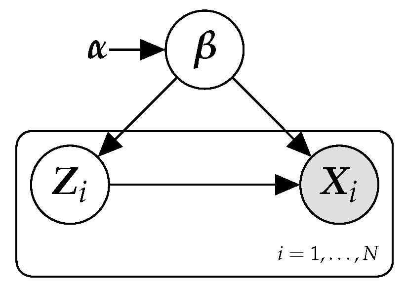
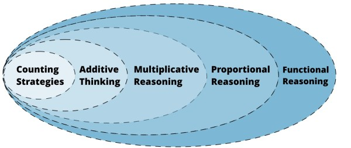
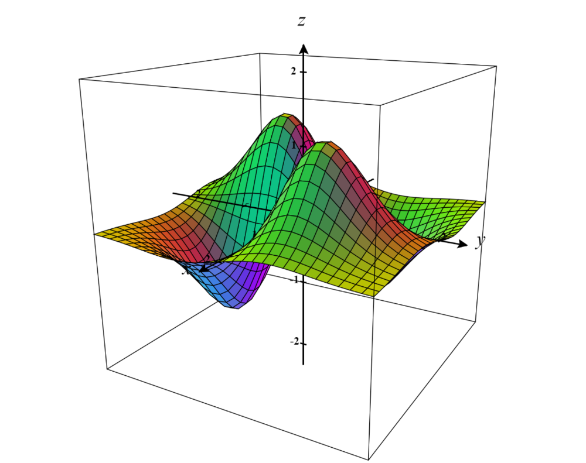

Below are full lists and details of the classes in which I served as an undergraduate teaching assistant at UCSD. The names of the instructors are listed based on the time I worked with them. Any available instructor evaluations are also attached.

<!-- ### Teaching by Department
{: .no_toc .text-delta }

1. TOC
{:toc} -->

#### Computer Science and Engineering

<table style="width:100%;border:0px;border-spacing:0px;border-collapse:separate;margin-right:auto;margin-left:auto;">

<tr>
    <td style="padding:2.5%;width:25%;vertical-align:middle;min-width:120px">
    
    </td>
    <td style="padding:2.5%;width:75%;vertical-align:middle">
    <h3>AI: Probabilistic Models</h3>
     
    Prof. Mary Anne Smart
     
    <em>UCSD CSE 150A S123</em>
     

    <!-- <a href="../assets/pdfs/evaluations/econ120b_eval.pdf">evaluation</a> / -->

    <a href="https://msmart14.github.io/cse-150a-summer23/">website</a>
    
    

    
Introduction to probabilistic models at the heart of modern artificial intelligence. Specific topics to be covered include probabilistic methods for reasoning and decision-making under uncertainty; inference and learning in Bayesian networks; prediction and planning in Markov decision processes; applications to intelligent systems, speech and natural language processing, information retrieval, and robotics.

    </td>
</tr>
</table>

#### Data Science

<table style="width:100%;border:0px;border-spacing:0px;border-collapse:separate;margin-right:auto;margin-left:auto;">
  <tr>
    <td style="padding:2.5%;width:25%;vertical-align:middle;min-width:120px">
      
    </td>
    <td style="padding:2.5%;width:75%;vertical-align:middle">
      <h3>The Practice and Application of Data Science (X2)</h3>
       
      Prof. Tauhidur Rahman, Prof. Suraj Rampure
       
      <em>UCSD DSC 80  SP23, WI23</em>
       
      
      <a href="../assets/pdfs/evaluations/dsc80_eval.pdf">evaluation</a> / <a href="https://dsc-courses.github.io/dsc80-2023-wi/">website</a>
      
      

      
Students master the data science life-cycle and learn many of the fundamental principles and techniques of data science spanning algorithms, statistics, machine learning, visualization, and data systems.

    </td>
  </tr>

  <tr>
    <td style="padding:2.5%;width:25%;vertical-align:middle;min-width:120px">
      
    </td>
    <td style="padding:2.5%;width:75%;vertical-align:middle">
      <h3>Theoretical Foundations of Data Science II</h3>
       
      Prof. Yusu Wang
       
      <em>UCSD DSC 40B  SP23</em>
       
      
      
      <a href="../assets/pdfs/evaluations/dsc40b_eval.pdf">evaluation</a> / <a href="https://dsc40b.com">website</a>
      
      

      
DSC 40B, the second course in the sequence, introduces fundamental topics in combinatorics, graph theory, probability, and continuous and discrete algorithms with applications to data analysis.

    </td>
  </tr>

  <tr>
    <td style="padding:2.5%;width:25%;vertical-align:middle;min-width:120px">
      
    </td>
    <td style="padding:2.5%;width:75%;vertical-align:middle">
      <h3>Theoretical Foundations of Data Science I</h3>
       
      Prof. Truong Son Hy
       
      <em>UCSD DSC 40A  FA22</em>
       
      
      <a href="../assets/pdfs/evaluations/dsc40a_eval.pdf">evaluation</a> /
      
      <a href="https://dsc-courses.github.io/dsc40a-2022-fa/">website</a>
      
      

      
DSC 40A will introduce fundamental topics in machine learning, statistics, and linear algebra with applications to data analysis.

    </td>
  </tr>

  <tr>
    <td style="padding:2.5%;width:25%;vertical-align:middle;min-width:120px">
      
    </td>
    <td style="padding:2.5%;width:75%;vertical-align:middle">
      <h3>Data Structures and Algorithms for Data Science </h3>
       
      Prof. Soohyun Liao
       
      <em>UCSD DSC 30  SP22</em>
       
      
      <a href="https://catalog.ucsd.edu/courses/DSC.html#dsc30">website</a>
      
      

      
Programming techniques including encapsulation, abstract data types, interfaces, algorithms and complexity, and data structures such as stacks, queues, priority queues, heaps, linked lists, binary trees, binary search trees, and hash tables with Java.

    </td>
  </tr>

  <tr>
    <td style="padding:2.5%;width:25%;vertical-align:middle;min-width:120px">
      
    </td>
    <td style="padding:2.5%;width:75%;vertical-align:middle">
      <h3>Programming and Basic Data Structures for Data Science (x3)</h3>
       
      Prof. Marina Langlois
       
      <em>UCSD DSC 20 SP22, WI22, FA21</em>
       
      
      
      <a href="https://dsc-courses.github.io/dsc20-2022-sp/">website</a>
      
      

      
Programming techniques including recursion, higher-order functions, function composition, object-oriented programming, interpreters, classes, and simple data structures such as arrays, lists, and linked lists.

    </td>
  </tr>

</table>

#### Mathematics
  
  
  
<table style="width:100%;border:0px;border-spacing:0px;border-collapse:separate;margin-right:auto;margin-left:auto;">
  <tr>
    <td style="padding:2.5%;width:25%;vertical-align:middle;min-width:120px">
      
    </td>
    <td style="padding:2.5%;width:75%;vertical-align:middle">
      <h3>Mathematical Reasoning</h3>
       
      Prof. John Eggers
       
      <em>UCSD MATH 109  SP22*</em>
       
      
      <a href="../assets/pdfs/evaluations/math109_eval.pdf">evaluation</a> /
      
      
      <a href="https://catalog.ucsd.edu/courses/MATH.html#math109">website</a>
      
      

      
This course uses a variety of topics in mathematics to introduce the students to rigorous mathematical proof, emphasizing quantifiers, induction, negation, proof by contradiction, naive set theory, equivalence relations and epsilon-delta proofs.

    </td>
  </tr>
  
  <tr>
    <td style="padding:2.5%;width:25%;vertical-align:middle;min-width:120px">
      
    </td>
    <td style="padding:2.5%;width:75%;vertical-align:middle">
      <h3>Introduction to Differential Equations (X2)</h3>
       
      Prof. Nandagopal Ramachandran, Prof. Ming Xiao
       
      <em>UCSD MATH 20D  FA22*, SP21*</em>
       
      
      <a href="../assets/pdfs/evaluations/math20d_eval.pdf">evaluation</a> /
      
      
      <a href="https://catalog.ucsd.edu/courses/MATH.html#math20d">website</a>
      
      

      
Ordinary differential equations: exact, separable, and linear; constant coefficients, undetermined coefficients, variations of parameters. Systems. Series solutions. Laplace transforms. Techniques for engineering sciences. Computing symbolic and graphical solutions using MATLAB.

    </td>
  </tr>

  <tr>
    <td style="padding:2.5%;width:25%;vertical-align:middle;min-width:120px">
      
    </td>
    <td style="padding:2.5%;width:75%;vertical-align:middle">
      <h3>Calculus and Analytic Geometry for Science and Engineering</h3>
       
      Prof. Emmanuel Vavalis
       
      <em>UCSD MATH 20C WI21*</em>
       
      
      
      <a href="https://catalog.ucsd.edu/courses/MATH.html#math20c">website</a>
      
      

      
Vector geometry, vector functions and their derivatives. Partial differentiation. Maxima and minima. Double integration. 

    </td>
  </tr>
  
  <tr>
    <td style="padding:2.5%;width:25%;vertical-align:middle;min-width:120px">
      
    </td>
    <td style="padding:2.5%;width:75%;vertical-align:middle">
      <h3>Calculus for Science and Engineering (X2)</h3>
       
      Prof. Yucheng Tu, Prof. Yuming Zhang
       
      <em>UCSD MATH 20A WI22, FA21</em>
       
      
      <a href="../assets/pdfs/evaluations/math20a_eval.pdf">evaluation</a> /
      
      
      <a href="https://catalog.ucsd.edu/courses/MATH.html#math20a">website</a>
      
      

      
Foundations of differential and integral calculus of one variable. Functions, graphs, continuity, limits, derivative, tangent line. Applications with algebraic, exponential, logarithmic, and trigonometric functions. Introduction to the integral.

    </td>
  </tr>
 
</table>

#### Economics

<table style="width:100%;border:0px;border-spacing:0px;border-collapse:separate;margin-right:auto;margin-left:auto;">

<tr>
    <td style="padding:2.5%;width:25%;vertical-align:middle;min-width:120px">
    
    </td>
    <td style="padding:2.5%;width:75%;vertical-align:middle">
    <h3>Econometrics (X2)</h3>
     
    Prof. Gordon Dahl, Prof. Maria Candido
     
    <em>UCSD ECON 120B WI23, FA22</em>
     

    <a href="../assets/pdfs/evaluations/econ120b_eval.pdf">evaluation</a> /

    <a href="https://catalog.ucsd.edu/courses/ECON.html#econ120b">website</a>
    
    

    
This course prepares students for empirical analysis in an academic or business setting. It covers the fundamentals of regression, including estimation and hypothesis testing in a univariate and multivariate framework. It presents ideas using the “potential outcomes” framework and makes the important distinction between prediction and causality. The course discusses reasons why estimators may be biased or inconsistent, and how both randomized experiments and natural experiments can be used to obtain causal estimates.

    </td>
</tr>
</table>

  
